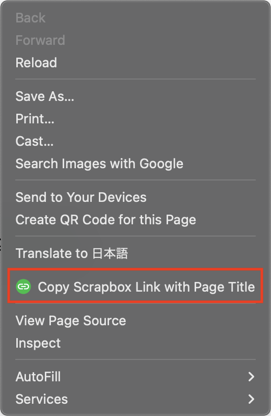

    

[![CI][ci-badge]][ci-url]
[![ChromeWebStore][chrome-web-store-badge]][chrome-web-store-url]
[![ChromeWebStoreUsers][chrome-web-store-users-badge]][chrome-web-store-url]

[ci-badge]: https://github.com/okaryo/ScrapboxQuickLink/actions/workflows/ci.yml/badge.svg
[ci-url]: https://github.com/okaryo/ScrapboxQuickLink/actions/workflows/ci.yml
[chrome-web-store-badge]: https://img.shields.io/chrome-web-store/v/dfpojhkidgkodjjhegidmmjeaimeakng
[chrome-web-store-url]: https://chromewebstore.google.com/detail/scrapboxquicklink/dfpojhkidgkodjjhegidmmjeaimeakng
[chrome-web-store-users-badge]: https://img.shields.io/chrome-web-store/users/dfpojhkidgkodjjhegidmmjeaimeakng

This is a Chrome extension to easily generate links for Scrapbox. Clicking on the extension menu that appears when right-clicking within a page will copy the link to the clipboard in the following format.

* Right-click within a page: `[page-title URL]`
* Right-click on a selected text: `[selection-text url]`

[Demo Movie](https://www.youtube.com/watch?v=Ws_dX3vSHj4)
